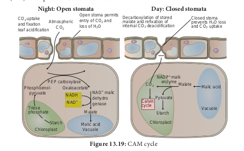

## 13.13 Crassulacean Acid Metabolism or CAM cycle

It is one of the carbon pathways identified in succulent plants growing in semi-arid or xerophytic condition. This was first observed in crassulaceae family plants like _Bryophyllum_, _Sedum_, _Kalanchoe_ and is the reason behind the name of this cycle. It is also noticed in plants from other families Examples: _Agave_, _Opuntia, Pineapple and Orchids. The stomata_ are closed during day and are open during night (Scotoactive). This reverse stomatal rhythm helps to conserve water loss through transpiration and will stop the fixation of CO2 during the day time. At night time CAM plants fix CO2 with the help of Phospho Enol Pyruvic acid (PEP) and produce oxalo acetic acid

(OAA). Subsequently OAA is converted into malic acid like C4 cycle and gets accumulated in vacuole increasing the acidity. During the day time stomata are closed and malic acid is decarboxylated into pyruvic acid resulting in the decrease of acidity. CO2 thus formed enters into Calvin Cycle and produces carbohydrates (Figure13.19).
**Significance of CAM Cycle**

1. It is advantageous for succulent plants to
   obtain CO2 from malic acid when stomata are closed.
2. During day time stomata are closed and CO2 is not taken but continue their photosynthesis.
3. Stomata are closed during the day time and help the plants to avoid transpiration and water loss.
