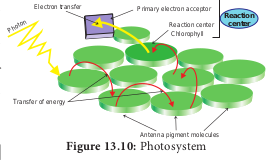

## 13.8 Photo-Oxidation Phase of Light

**Reaction** The action of photon plays a vital role in excitation of pigment molecules to release an electron. When the molecules absorb a photon, it is in excited state. When the light source turned off, the high energy electrons return to their normal low energy orbitals as the excited molecule goes back to its original stable condition known as **ground state**. When molecules absorb or emit light they change their electronic state. Absorption of blue light excites the chlorophyll to higher energy state than absorption of Red light, because the energy of photon is higher when their wavelength is shorter. When the pigment molecule is in an excited state, this excitation energy is utilised for the phosphorylation. Phosphorylation takes place with the help of light generated electron and hence it is known as **photophosphorylation**.

### 13.8.1 Photosystem and Reaction Centre

- Thylakoid membrane contains Photosystem I (PS I) and Photosystem II (PS II).

- PS I is in unstacked region of granum facing stroma of chloroplast.

- PS II is found in stacked region of thylakoid membrane facing lumen of thylakoid.

**Table 13.2: Differences between Photosystem I and Photosystem II**
| Photosystem I | Photosystem II |
| :-----------: | :------------: |
| 1. The reaction centre is P700 | 1. Reaction centre is P680 |
| 2. PS I is involved in both cyclic and non-cyclic. | 2. PS II participates in Non-cyclic pathway |
| 3. Not involved in photolysis of water and evolution of oxygen | 3. Photolysis of water and evolution of oxygen |
| 4. It receives electrons from PS II during non-cyclic photophosphorylation | 4. It receives electrons by photolysis of water |
| 5. Located in unstacked region granum facing chloroplast stroma | 5. Located in stacked region of thylakoid membrane facing lumen of thylakoid. |
| 6. Chlorophyll and Carotenoid ratio is 20 to 30:1 take place. | 6. Chlorophyll and Carotenoid ratio is 3 to 7:1 |

- Each Photosystem consists of central core complex (CC) and light harvesting Complex (LHC) or Antenna molecules (Figure 13.10).

- The core complex consists of respective reaction centre associated with proteins, electron donors and acceptors.

- PS I – CC I consists of reaction centre P700 and LHC I.

- PS II – CC II consists of reaction centre P680 and LHC II (Table 13.2).

- Light Harvesting Complex consists of several chlorophylls, carotenoids and xanthophyll molecules.

- The main function of LHC is to harvest light energy and transfer it to their respective reaction centre.

